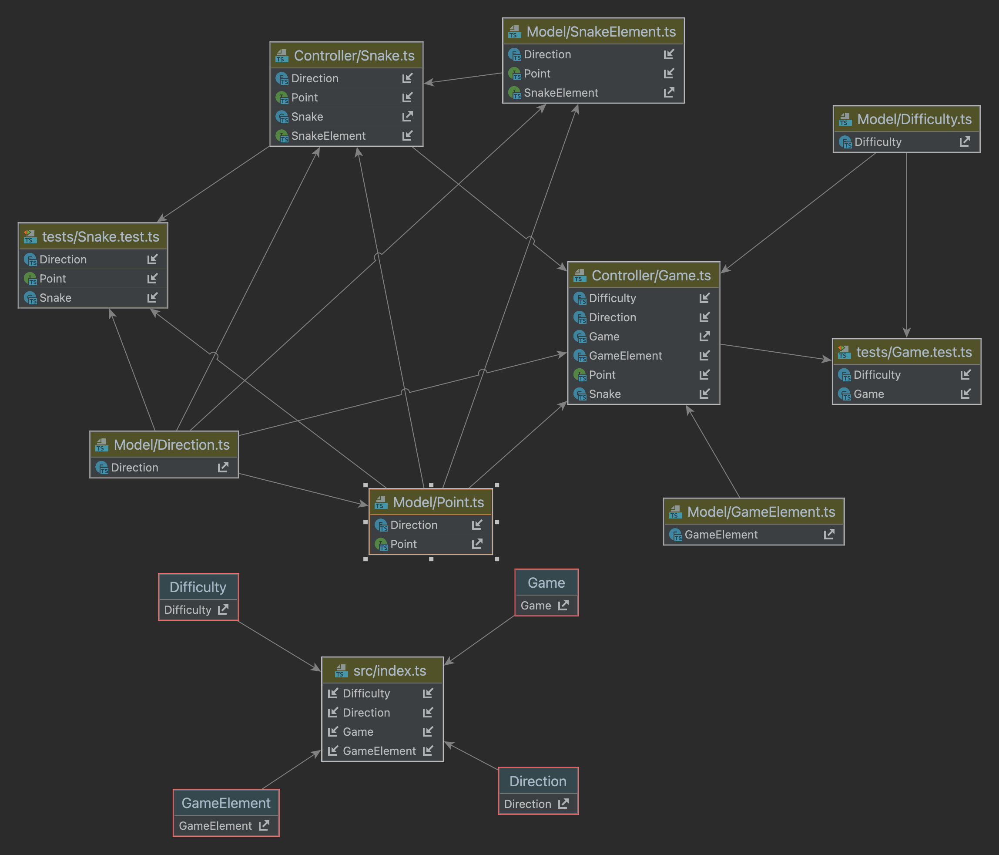
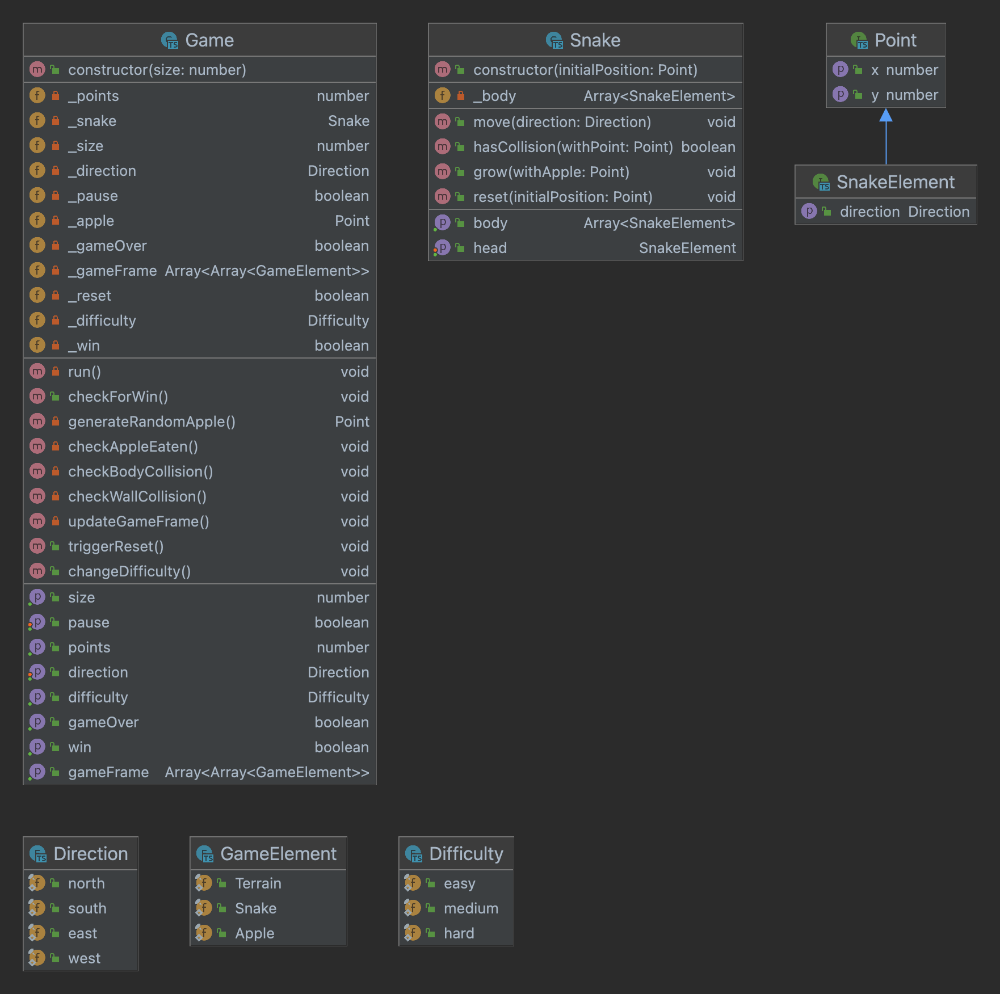

# Simple Snake game

[Play here](https://bumbeneciconstantinbogdan.github.io/typescript-snake)

This simple game was built to accomplish all the task required for my homework:

- Object oriented programming ( With the help of typescript )
- Write some test (Jest came in help)
- Draw some UML (using InteliJ diagrams)
- Upload on github :)

## Public folder

Contains all the required file to enjoy the game

Thanks to the project from https://klesun.github.io/ts-browser/ I was able to run typescript directly in browser.

I should also thanks to YouTube channel @FreeMusicc to provide song used as background music for my little game.

## SRC

To build the project just type 'npm run build'. 

## UML Diagrams

